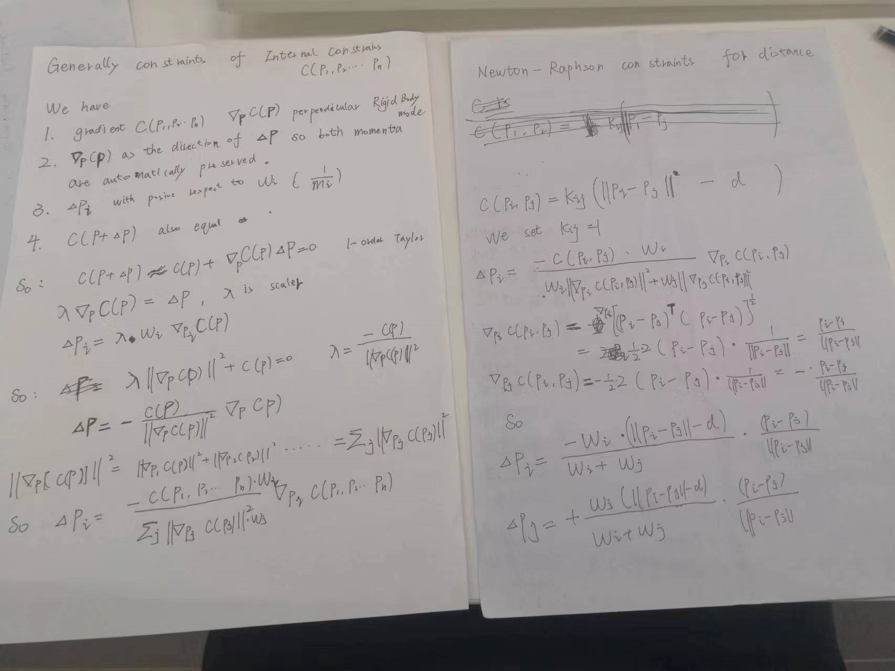

This folder is about create square cloth mesh in different Software Framework.


note no self collision process:  taichi_pbd.py

### Requirements about python version

taichi_pbd.py  need this environment

```shell
 pip install taichi=1.3.0
```

### Requirements about CUDA / OpenGL version

ToDo......


### PBD introduction and Derivation

**A simple PBD algorithm architecture .** 

vertices:  $$i \in \{1,2,3,.....N\}$$, 

constrains: $$ C_j \in \{C_1,C_2, .... C_M\} $$  

parameter: dt as the single simulation time step, stiffness k as the constraint parameter

```pseudocode
for all vertices i 
	initialize x[i] = x0[i] , v[i] = v0[i], w[i] = 1/ mass[i]
end for
loop
	for all vertices i do v[i] = v[i] + dt * w[i] * externel_force(x)[i] end for
	dampingVelocities(v[1],v[2], ... v[N])  ## damping form 
	for all vertices i do p[i]<- x[i] + dt * v[i] end for
	for all vertices i do generateCollisionConstraints( x[i] -> p[i]) end for
	
	loop solverIterations times
		projectConstrains(C[1],C[2],C[3], C[M], .. C[M+Mcoll], P[1],P[2]...p[N])
	end loop
	for all vertices 
		v[i] = (p[i] - x[i]) / dt
		x[i] = p[i]
	end for
    velocityUpdate(v[1],....,v[N]) ## modified according to friction and restitution coefficients.
end loop
```


**PBD algorithm architecture for cloth simulation**

vertices:  $$i \in \{1,2,3,.....N\}$$, 

constrains: $$ C_j \in \{C_1,C_2, .... C_M\} $$  , assume constrain include distance constraint function and generated collision constraints ( no self-collision, self-collision is shown in self-collision folder)

parameter: dt as the single simulation time step. assume only gravity as the external_force, k_damping is linear parameter

```pseudocode
for all vertices i 
	initialize vec3 x[i] = x0[i] , vec3 v[i] = v0[i], vec3 p[i] , float w[i] = 1/ mass[i]
end for
loop
	for all vertices i do 
		v[i] = v[i] + dt * w[i] * gravity
		v[i] = k_damping * v[i]
		p[i] <- x[i] + dt * v[i]
	end for 
	loop solverIterations times
		for all edges (i,j) do
			# L2 means distance of p[i], p[j], d means constrants set distance 
			vec3 tmp = (L2(p[i]-p[j]) - d) * (p[i] - p[j]) / L2(p[i] - p[j])  
			p[i] = p[i] - w[i] / (w[i] + w[j]) * tmp
			p[j] = p[j] + w[j] / (w[i] + w[j]) * tmp
		end for
	end loop
	for all vertices i 
		v[i] = (p[i] - x[i]) / dt
		x[i] = p[i]
	end for
	for all vertives i
		v[i], x[i] = collision_detection_and_response(v[i],x[i])
	end for
    for all vertices i
    	v[i] = velocityupdate(v[i]) # modified according to friction and restitution coefficients.
    end for 
end loop
```


**Constraint Derivation:**

Newton-Raphson method( little chaos :) )：




### reference

https://matthias-research.github.io/pages/

https://matthias-research.github.io/pages/publications/publications.html

https://dl.acm.org/doi/10.1016/j.jvcir.2007.01.005